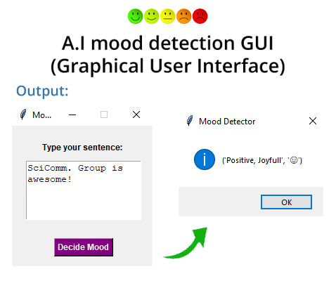
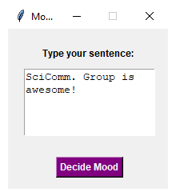
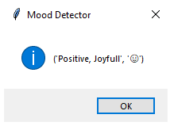

# A.I mood detector GUI
Mood detection GUI window to detect emotional tone of the text.

### Used Packages:
* [Tkinter](https://docs.python.org/3/library/tkinter.html)
* [TextBlob](https://textblob.readthedocs.io/en/dev/)
* [Emoji](https://pypi.org/project/emoji/)

### Window output:

